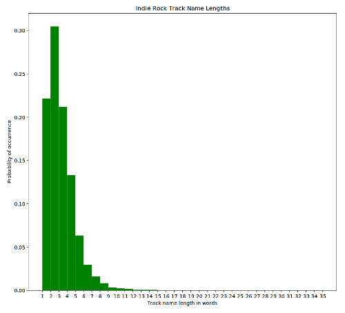
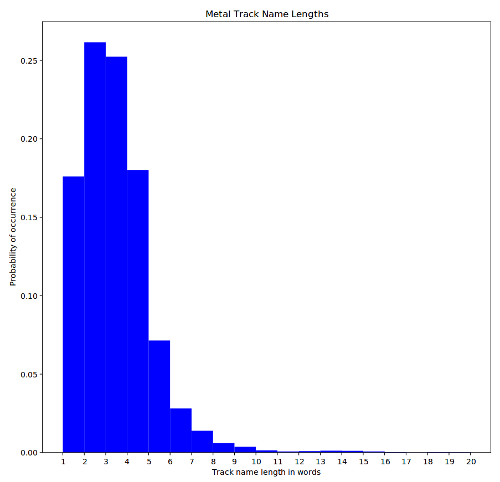
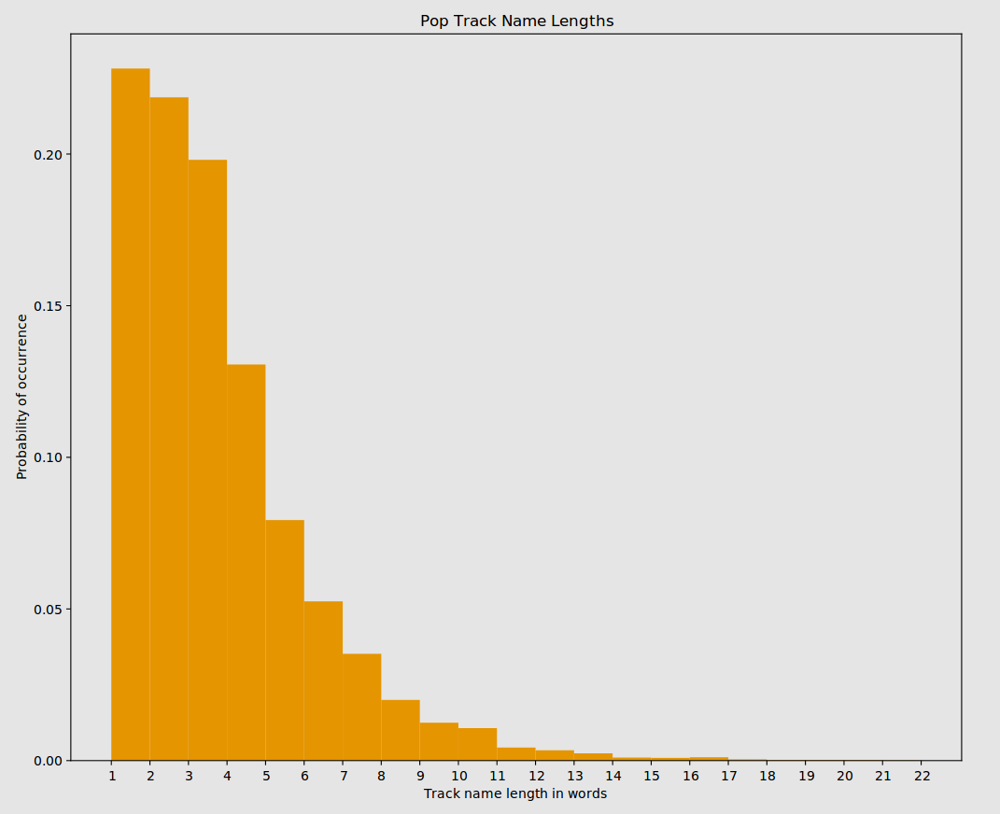

# Mini-Project 3: Project Writeup/Reflection
##### Random Song Name Generation
##### Matt Brucker

### Project Overview

For this project, I hoped to create a program that would generate random track names for a song of a given genre. The idea was to show the syntactic similarities within a particular genre of music by 
creating a "genre-like" song title. In order to accomplish this, I used the Spotify API as the system for retrieving a corpus of song titles. It uses the search feature of the Spotify API, with 
[Spotipy](https://github.com/plamere/spotipy) as the Python wrapper, to pull up to 10,000 songs of a particular genre. Then, using the corpus of 10,000 song titles, it uses Markov chains to generate a song 
title. A second optional step uses frequency analysis of the track name lengths in order to generate song titles that more closely resemble song titles of a genre in length. All of these options are 
configurable through command-line flags.

### Results
**Markov chain generation**

My program utilizes [Markovify](https://github.com/jsvine/markovify) to generate track titles based on a particular genre. Note that the Markov chains have a depth of 1; anything higher doesn't work well with
song names, as most song names are fairly short. All that is required is to pass in the genre name as a command-line argument; 
multi-word genres should be put in quotation marks. This program works with any genre listed in Spotify's [944 genres](https://docs.google.com/spreadsheets/d/1L3F3oKddQxz2v9a_eqchacv4XXqVru1AMwsbVUqqMsU/pub).
```
>>> python3 spotify_scrape.py "Indie Rock"
Better Styrofoam Boots/it's All Your Protector
```
If you're running it with a genre that has never been searched before, it has to pull the data from the Spotify API before analyzing it. Once the data for a particular genre has been retrieved once, it's 
stored in a text file "genre_name.txt."
``` 
>>> python3 spotify_scrape.py "Chamber Pop"
Downloading list of tracks...
Whenever I Get Carried Home On My Love Letters Home
```
The differences in language of song titles between genres are easily demonstrated by generating a song
name from two very different genres:
```
>>> python3 spotify_scrape.py "Pop"
Cool Girl On Love You're Not Like Smoke

>>> python3 spotify_scrape.py "Metal"
Victim Of Monster Die Young To Rock
```

**Track Name Length Frequency Analysis**

One issue with simply using Markov chains to generate song titles is that Markov chains don't usually work well with generating fixed-length sentences. This is usually okay for generating prose, but since
most song titles tend to be much shorter than a sentence in length, the song titles generated using only Markov chains are usually much longer than most actual song titles. Thus, as a second form of text
analysis, I created a method of generating song titles that match the length of song titles in a genre. The program looks at the length of each song title, in words, and generates a probability distribution
of the song title lengths for that particular genre.  The histograms below demonstrate the difference in name length frequencies between genres.





Then, when a song title is generated, a length is also randomly selected based on the probability distribution of the various lengths. However, in order to make this fit with Markov chains, which aren't
very compatible with fixed-length sentence generation, multiple Markov chains sometimes have to be stringed together and truncated - which isn't ideal, but still retains some of the qualities of the Markov
chain while also allowing for generation of fixed-length strings. 
```
>>> python3 spotify_scrape.py "Indie Rock" --fixed
There’s A Dog I'll
>>> python3 spotify_scrape.py "Indie Rock" --fixed
Killing Lies
>>> python3 spotify_scrape.py "Indie Rock" --fixed
My
>>> python3 spotify_scrape.py "Indie Rock" --fixed
Psst,
>>> python3 spotify_scrape.py "Indie Rock" --fixed
Tonight's The
```
The fixed-length title generation can be enabled with an optional flag `--fixed`.

### Reflection
Overall, I feel as though I accomplished most of what I set out to do. The Markov chains work well, and I also performed a fair amount of preprocessing on the data in order to remove a lot of unwanted
artifacts. Thus, the Markov chains produce interesting results that work pretty well. On the other hand, I don't feel as though I found a very optimal solution for the fixed-length tracks. While it does
generate tracks names that seem to fit in length, it doesn't work particularly well with the Markov chains, and as a result the track names are often cut off. It was also difficult to write unit tests for
this project; because nearly everything was based on random generation, it was very difficult to write consistent unit tests. Still, overall, I'm very happy with the outcome of the project. In most ways, it
works well, and I feel as though I learned a lot, particularly in the realm of writing code that extends existing libraries - I wrote a modification of the Markovify library in order to better parse the song
titles. 

